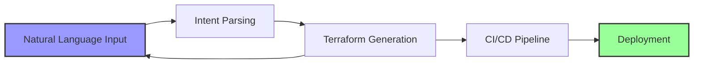

# ⚡ Stratisail

> Infrastructure that speaks your language


Natural language driven CI/CD with Terraform integrations.

## 🎯 The Vision

**Stop writing YAML. Start talking.**

Traditional infrastructure deployment is broken. We're fixing it with natural language and AI.

## What We Do

Transform infrastructure deployment through conversational AI. Describe your infrastructure needs in plain English, and we'll generate and deploy the appropriate Terraform configurations.


## Core Concept

Instead of writing complex Terraform configurations:

```bash
# Traditional approach
terraform init
terraform plan -var-file="prod.tfvars"
terraform apply
```

Simply describe what you need:

```
"Deploy a CI/CD pipeline that works with my Terraform"
```

## Architecture
## Architecture




That's it. Really.

---

<div align="center">
  <strong>Building the future of infrastructure</strong>
  <br>
  <em>🌊 Ride the wave</em>
</div>
