# ⚡ Stratisail

> Infrastructure that speaks your language

Natural language driven CI/CD with Terraform integrations.

## 💫 The Vision

**Stop writing YAML. Start talking.**

Traditional infrastructure deployment is broken. We're fixing it with natural language and AI.

## Architecture

```mermaid
graph LR
    A[💬 Natural Language Input] --> B[🧠 Intent Parsing]
    B --> C[⚙️ Workflow Generation]
    F[🏗️ Terraform Infrastructure] --> C
    C --> D[🔄 Pipeline Configuration]
    D --> E[🚀 Deployment]
        
    style A fill:#6495ED,stroke:#333,stroke-width:2px
    style B fill:#9370DB,stroke:#333,stroke-width:2px
    style C fill:#20B2AA,stroke:#333,stroke-width:2px
    style D fill:#FFA07A,stroke:#333,stroke-width:2px
    style E fill:#90EE90,stroke:#333,stroke-width:2px
    style F fill:#6495ED,stroke:#333,stroke-width:2px
```

That's it. Really.

---

  <strong>Building the future of infrastructure</strong>
   
  <em>🌊 Ride the wave</em>

